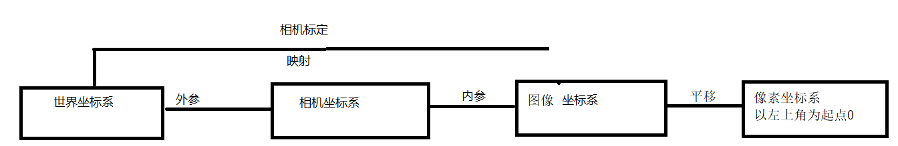
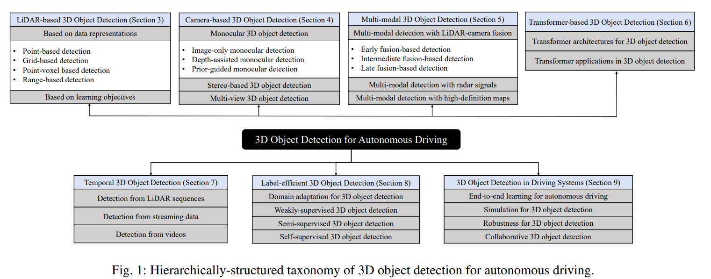
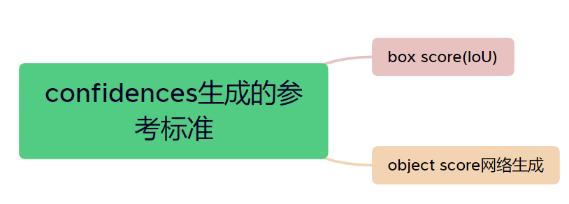

在pytorch中设置变量W的梯度为True就是在正向传播中记录关键数据 
*其中C为输出和标签的差距值* 
*z是上一层的输出*

# 生成式模型和判别式模型

* 生成式模型对应联合概率分布和贝叶斯公式 
* 判别式模型已知特征X1，求y1。这就是条件概率p(y1|X1)

# numpy上犯的错误
  > matrix=[[1,2,3],[4,5,6]] 
  matrix[True,False][0]=[1,2,3] 
  而不是1

因为
>matrix[True,False][0]是两个步骤
先matrix[True,False]=[[1,2,3]] 
后[[1,2,3]]取[0]=[1,2,3]

  
# spp fpn ssd式目标检测
## spatial pyramid pooling
  
* 将最后一层的特征图输出 通过融合不同尺度pooling的方式 调整为固定大小(全连接层需要) 

## feature pyramid networks
* 基于多层次特征图的处理
  * 高层特征图包含更有效的语义特征但失去了过多细节信息
  * 低层特征图有细节信息但是不够抽象

  
# 卷积vs全连接

<b>相同点</b>：
* 卷积和全连接有相同的函数性质(都是元素值进行点积)(可以相互替换) 

<b>不同点</b>：
* 卷积关注的是局域，而且参数共享
* 卷积包含一个先验：位置上临近的部分，其特征也相关

# 关于cuda和cudnn
## nvidia区分为`runtime api`和 `driver api`
* `nvidia driver`自带 nvidia-smi程序，可以显示driver api的版本信息
  * 平时只需要有nvidia driver和gpu版本的pytorch/tf(含必要的cuda-lib)就可以使用gpu加速计算
* `cuda toolkit`是一个和开发有关的库，提供`nvcc (-V)`和runtime api
    * 想要编译深度学习库(cu,cuh等)必须下载cuda toolkit
* cudnn提供更多如(卷积)的软件函数库

# 相机标定

# SLAM
## simultaneous localization and mapping
典型应用扫地机器人

# 3d目标检测数据集

* Waymo Open Dataset(WOD)是谷歌Waymo无人驾驶公司在2020年发布出来的数据集 
*  KITTI datasetsKITTI数据集由德国卡尔斯鲁厄理工学院和丰田工业大学芝加哥分校联合赞助的用于自动驾驶领域研究的数据集

# 值得一看的论文

# 值得一看的课程
* cs231A
* cs231n
# 图像分割
* 语义分割：逐个像素分类(典型代表*fcn*)
* 实例分割：目标检测+语义分割，对感兴趣的对象进行精细分割
* 全景分割：全局的实例分割，对图像上所有成分进行分割
# 3d目标检测综述

# 基于LiDAR的3d目标检测

# fcos(fully convolutional one stage)
## 类似fcn(fully convolutional network)
一种基于语义分割改进的目标检测方法

## fcos的两个细节
1. 网络学习的不再是anchor到bbox的变换关系，而是图像原始位置到bbox的变换关系
2. 在共享head层参数的情况下，应对不同尺度的检测目标

# AP mAP计算
* 随选定的top-K 越来越多recall一定会越来越高，而precision整体上会呈下降趋势
* 在目标检测中 mAP综合考量了localization 和 classification

## confidence

# fasterRCNN思考
* <b>anchor机制的理解</b>
  
* two stage
  * stage one 
    又叫rpn，网络学习的是anchor->groud truth之间的关系，最终生成proposals

  * stage two
    mlp，网络学习的是proposals->groud truth之间的关系，最终生成bbox

# 下一步计划
* 细读fcos3D，理解点云
* 跑通mmdetection3D上的fcos3D
* 阅读detr和detr3D，实现完善自己的transformer

# CITE

* Mao, J., Shi, S., Wang, X., & Li, H. (2023). `3D object detection for autonomous driving: A comprehensive survey`. International Journal of Computer Vision, 1-55.
* Z. Tian, C. Shen, H. Chen and T. He, "`FCOS: A Simple and Strong Anchor-Free Object Detector`," in IEEE Transactions on Pattern Analysis and Machine Intelligence, vol. 44, no. 4, pp. 1922-1933, 1 April 2022, doi: 10.1109/TPAMI.2020.3032166.
*  Wang, Tai , et al. "`FCOS3D: Fully Convolutional One-Stage Monocular 3D Object Detection`." (2021).
*  Lin, Tsung Yi , et al. "`Feature Pyramid Networks for Object Detection`." IEEE Computer Society (2017).
*  Chen, Kai, et al. "`MMDetection: Open mmlab detection toolbox and benchmark`." arXiv preprint arXiv:1906.07155 (2019).
* `fcos` web:https://zhuanlan.zhihu.com/p/385332512
* `mmdection` web:https://zhuanlan.zhihu.com/p/337375549
* `spp/fpn` web:https://blog.csdn.net/wsp_1138886114/article/details/81778202
* `cuda/cudnn` web:https://www.cnblogs.com/marsggbo/p/11838823.html
* `mAP` web:http://tarangshah.com/blog/2018-01-27/what-is-map-understanding-the-statistic-of-choice-for-comparing-object-detection-models/